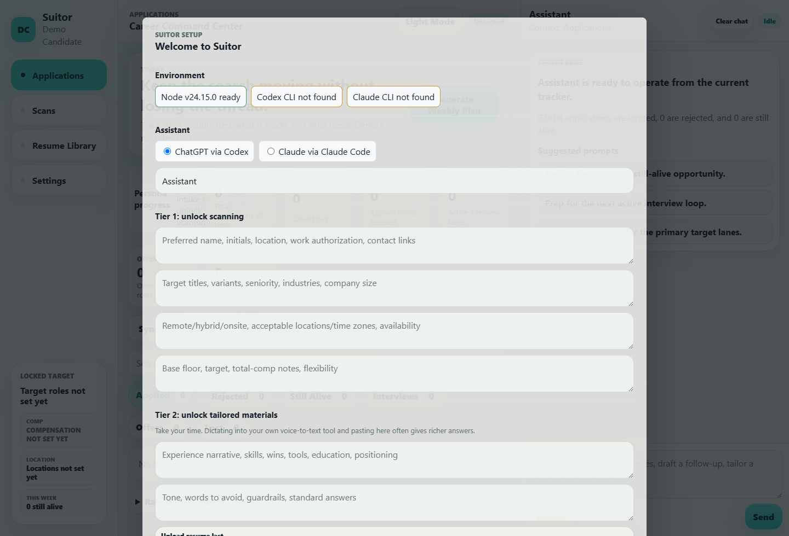
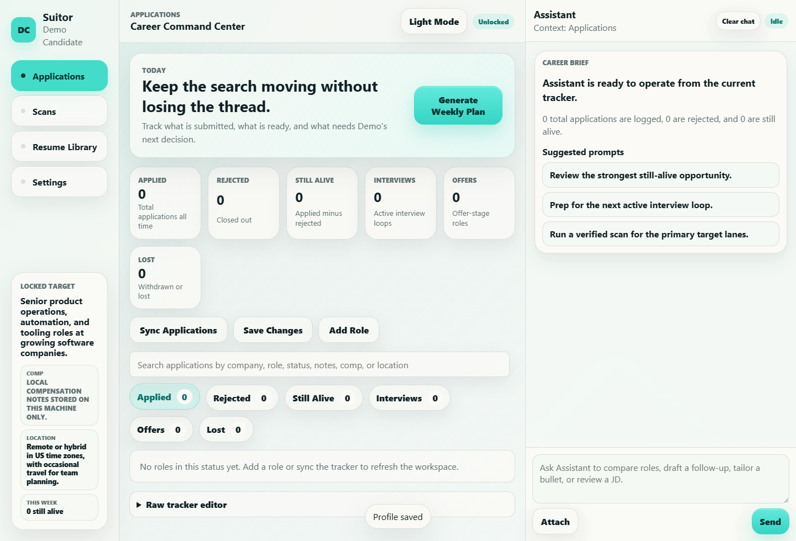

# Suitor

Suitor is a local-first job-search assistant. It helps you build a candidate profile, scan job sources, draft tailored application materials, and track applications, rejections, interviews, and offers in a local SQLite database.

Suitor runs on your machine. There is no hosted Suitor service, no telemetry, and no account with us. Your assistant runs through your own Codex CLI or Claude Code CLI login.

## Quickstart

Requirements:

- Node.js 22.5 or newer
- Git
- One local AI CLI: OpenAI Codex (`codex`) or Anthropic Claude Code (`claude`)

Windows PowerShell:

```powershell
git clone https://github.com/Bizmaniz/suitor.git
cd suitor
npm install
npm run setup
npm start
```

macOS or Linux:

```bash
git clone https://github.com/Bizmaniz/suitor.git
cd suitor
npm install
npm run setup
npm start
```

Open [http://127.0.0.1:8787](http://127.0.0.1:8787), unlock with the token in `<profile root>/.suitor-runtime/local.app-token`, and finish the wizard.

## Screenshots





## First Run

The wizard walks through:

1. Environment check for Node, Codex, and Claude.
2. LLM choice: ChatGPT via Codex or Claude via Claude Code.
3. Assistant name.
4. A staged recruiter interview that asks for evidence, constraints, tradeoffs, energizers, drainers, and dealbreakers.
5. Rich fallback form sections if you would rather paste structured notes than chat.
6. Connections: local database, LinkedIn manual browser session, providers, custom RSS feeds, and target companies.

Tier 1 unlocks scanning once basics, target-role direction, logistics, and compensation floor exist. Tier 2 unlocks tailored materials once experience/proof, strengths, and voice guardrails exist. Tier 3 is optional and improves matching with workflow, culture, industry, growth, tradeoff, and dealbreaker detail.

The intake writes `Candidate Search Profile.md`, `Candidate Search Profile.json`, `Job Scan Prompt.md`, and `Intake Status.md` under your profile folder. The JSON includes scoring weights, hard filters, automatic rejection criteria, manual-review criteria, and exclude keywords used by scans.

## Workspaces

Suitor keeps daily work, profile knowledge, and system controls separate:

- **Work:** Applications, Scans, Capture, and Resume Studio.
- **Knowledge:** Learning Insights, Assessments, and Reference Library.
- **System:** Settings for connections, source configuration, security, backup, and exports.

Capture accepts pasted application emails and manually discovered roles without connecting to an inbox. Manual captures are deduplicated in the profile-local SQLite database and can be removed with a soft-delete action. Learning Insights summarizes source activity and durable outcomes without turning historical patterns into automatic rules.

## Security And Your Data

- Local-only: profile, resume, scans, generated drafts, browser state, and SQLite database stay on your machine.
- Localhost by default: the server binds to `127.0.0.1`. `SUITOR_HOST=0.0.0.0` is an explicit LAN opt-in.
- No stored LLM keys: Suitor uses your local CLI authentication.
- No stored LinkedIn password: LinkedIn uses a real browser session with manual login.
- No auto-apply: Suitor scans and drafts. You confirm every application or message yourself.

Read [docs/SCANNING_SAFELY.md](docs/SCANNING_SAFELY.md) before using browser-based sources.

## Documentation

- [docs/INSTALL.md](docs/INSTALL.md)
- [docs/CONFIG.md](docs/CONFIG.md)
- [docs/SOURCES.md](docs/SOURCES.md)
- [docs/SCANNING_SAFELY.md](docs/SCANNING_SAFELY.md)
- [docs/TROUBLESHOOTING.md](docs/TROUBLESHOOTING.md)
- [docs/WORKSPACES.md](docs/WORKSPACES.md)
- [docs/MIGRATIONS.md](docs/MIGRATIONS.md)

## Useful Commands

```bash
npm run setup
npm start
npm run doctor
npm run check:clean
npm run test:regression
```

## License

MIT. You are responsible for complying with the terms of any site or service you connect to Suitor.
